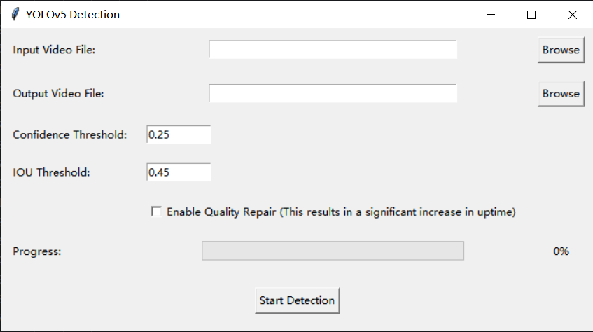
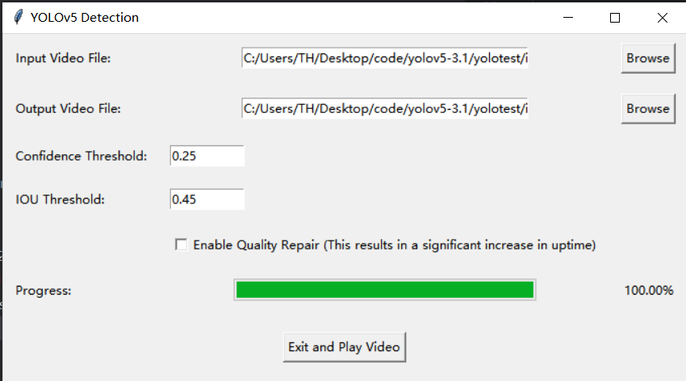

# Multi-target detection and tracking based on yolov5 and deepsort

## Prepare 
1 Create a virtual environment with Python >=3.8  
~~~
conda create -n [your_own_env_name] python=3.8    
conda activate [your_own_env_name]   
~~~

2 Install pytorch >= 1.6.0, torchvision >= 0.7.0.
~~~
conda install pytorch torchvision cudatoolkit=10.1 -c pytorch
~~~

3 Install all dependencies
~~~
pip install -r requirements.txt
~~~

4 Download the yolov5 weight. 
I already put the `yolov5s.pt` inside. If you need other models, 
please go to [official site of yolov5](https://github.com/ultralytics/yolov5). 
and place the downlaoded `.pt` file under `yolov5/weights/`.   
And I also aready downloaded the deepsort weights. 
You can also download it from [here](https://drive.google.com/drive/folders/1xhG0kRH1EX5B9_Iz8gQJb7UNnn_riXi6), 
and place `ckpt.t7` file under `deep_sort/deep/checkpoint/`

## Run
~~~
# on video file
python detect.py
~~~

Then you will then see a user interface as shown in the image.

You can choose the input video and the location of the output video. Key parameters in the algorithm can also be adjusted, and there is also an option to control whether image enhancement is turned on (note that turning this on dramatically increases the time it takes to process the video).
After completing these basic Settings, you can click on "start" to start working on the video.
You can see from the progress bar on the UI how much the program is running.

When the video is finished, you should see a UI similar to this. Click "Exit" and it will take you to the place you specified to save the output video.

# Video location
The video data set I used stored under `inference/input/`, the output video stored
under `inference/output/`. 

## Reference
1) [Yolov5_DeepSort_Pytorch](https://github.com/mikel-brostrom/Yolov5_DeepSort_Pytorch)   
2) [yolov5](https://github.com/ultralytics/yolov5)  
3) [deep_sort_pytorch](https://github.com/ZQPei/deep_sort_pytorch)       
4) [deep_sort](https://github.com/nwojke/deep_sort)  

## Environment
~~~
# packages in environment at C:\Users\TH\anaconda3\envs\py38:
#
# Name                    Version                   Build  Channel
absl-py                   2.1.0                    pypi_0    pypi
blas                      1.0                         mkl    https://mirrors.tuna.tsinghua.edu.cn/anaconda/pkgs/free
brotli-python             1.0.9            py38hd77b12b_8    https://mirrors.tuna.tsinghua.edu.cn/anaconda/pkgs/main
ca-certificates           2024.3.11            haa95532_0    https://mirrors.tuna.tsinghua.edu.cn/anaconda/pkgs/main
cachetools                5.3.3                    pypi_0    pypi
certifi                   2024.2.2         py38haa95532_0    https://mirrors.tuna.tsinghua.edu.cn/anaconda/pkgs/main
charset-normalizer        2.0.4              pyhd3eb1b0_0    https://mirrors.tuna.tsinghua.edu.cn/anaconda/pkgs/main
contourpy                 1.1.1                    pypi_0    pypi
cudatoolkit               10.1.243             h74a9793_0    https://mirrors.tuna.tsinghua.edu.cn/anaconda/pkgs/main
cycler                    0.12.1                   pypi_0    pypi
cython                    3.0.10                   pypi_0    pypi
easydict                  1.13                     pypi_0    pypi
filelock                  3.13.1           py38haa95532_0    https://mirrors.tuna.tsinghua.edu.cn/anaconda/pkgs/main
fonttools                 4.51.0                   pypi_0    pypi
freetype                  2.4.10                        0    https://mirrors.tuna.tsinghua.edu.cn/anaconda/pkgs/free
gmpy2                     2.1.2            py38h7f96b67_0    https://mirrors.tuna.tsinghua.edu.cn/anaconda/pkgs/main
google-auth               2.29.0                   pypi_0    pypi
google-auth-oauthlib      1.0.0                    pypi_0    pypi
grpcio                    1.63.0                   pypi_0    pypi
idna                      3.7              py38haa95532_0    https://mirrors.tuna.tsinghua.edu.cn/anaconda/pkgs/main
importlib-resources       6.4.0                    pypi_0    pypi
intel-openmp              2021.4.0          haa95532_3556    https://mirrors.tuna.tsinghua.edu.cn/anaconda/pkgs/main
jinja2                    3.1.3            py38haa95532_0    https://mirrors.tuna.tsinghua.edu.cn/anaconda/pkgs/main
jpeg                      8d                            0    https://mirrors.tuna.tsinghua.edu.cn/anaconda/pkgs/free
kiwisolver                1.4.5                    pypi_0    pypi
libffi                    3.4.4                hd77b12b_1    https://mirrors.tuna.tsinghua.edu.cn/anaconda/pkgs/main
libjpeg-turbo             2.0.0                h196d8e1_0    https://mirrors.tuna.tsinghua.edu.cn/anaconda/pkgs/main
libpng                    1.6.17                        0    https://mirrors.tuna.tsinghua.edu.cn/anaconda/pkgs/free
libtiff                   4.0.2                         1    https://mirrors.tuna.tsinghua.edu.cn/anaconda/pkgs/free
libuv                     1.44.2               h2bbff1b_0    https://mirrors.tuna.tsinghua.edu.cn/anaconda/pkgs/main
libwebp                   1.2.4                h2bbff1b_0    https://mirrors.tuna.tsinghua.edu.cn/anaconda/pkgs/main
libwebp-base              1.2.4                h2bbff1b_1    https://mirrors.tuna.tsinghua.edu.cn/anaconda/pkgs/main
markdown                  3.6                      pypi_0    pypi
markupsafe                2.1.3            py38h2bbff1b_0    https://mirrors.tuna.tsinghua.edu.cn/anaconda/pkgs/main
matplotlib                3.7.5                    pypi_0    pypi
mkl                       2021.4.0           haa95532_640    https://mirrors.tuna.tsinghua.edu.cn/anaconda/pkgs/main
mkl-service               2.4.0            py38h2bbff1b_0    https://mirrors.tuna.tsinghua.edu.cn/anaconda/pkgs/main
mkl_fft                   1.3.1            py38h277e83a_0    https://mirrors.tuna.tsinghua.edu.cn/anaconda/pkgs/main
mkl_random                1.2.2            py38hf11a4ad_0    https://mirrors.tuna.tsinghua.edu.cn/anaconda/pkgs/main
mpc                       1.1.0                h7edee0f_1    https://mirrors.tuna.tsinghua.edu.cn/anaconda/pkgs/main
mpfr                      4.0.2                h62dcd97_1    https://mirrors.tuna.tsinghua.edu.cn/anaconda/pkgs/main
mpir                      3.0.0                hec2e145_1    https://mirrors.tuna.tsinghua.edu.cn/anaconda/pkgs/main
mpmath                    1.3.0            py38haa95532_0    https://mirrors.tuna.tsinghua.edu.cn/anaconda/pkgs/main
networkx                  3.1              py38haa95532_0    https://mirrors.tuna.tsinghua.edu.cn/anaconda/pkgs/main
numpy                     1.24.3           py38hf95b240_0    https://mirrors.tuna.tsinghua.edu.cn/anaconda/pkgs/main
numpy-base                1.24.3           py38h005ec55_0    https://mirrors.tuna.tsinghua.edu.cn/anaconda/pkgs/main
oauthlib                  3.2.2                    pypi_0    pypi
opencv-python             4.9.0.80                 pypi_0    pypi
openssl                   3.0.13               h2bbff1b_1    https://mirrors.tuna.tsinghua.edu.cn/anaconda/pkgs/main
pillow                    10.3.0                   pypi_0    pypi
pip                       23.3.1           py38haa95532_0    https://mirrors.tuna.tsinghua.edu.cn/anaconda/pkgs/main
protobuf                  5.26.1                   pypi_0    pypi
pyasn1                    0.6.0                    pypi_0    pypi
pyasn1-modules            0.4.0                    pypi_0    pypi
pyparsing                 3.1.2                    pypi_0    pypi
pysocks                   1.7.1            py38haa95532_0    https://mirrors.tuna.tsinghua.edu.cn/anaconda/pkgs/main
python                    3.8.19               h1aa4202_0    https://mirrors.tuna.tsinghua.edu.cn/anaconda/pkgs/main
pytorch                   2.3.0               py3.8_cpu_0    pytorch
pytorch-mutex             1.0                         cpu    pytorch
pyyaml                    6.0.1            py38h2bbff1b_0    https://mirrors.tuna.tsinghua.edu.cn/anaconda/pkgs/main
requests                  2.31.0           py38haa95532_1    https://mirrors.tuna.tsinghua.edu.cn/anaconda/pkgs/main
requests-oauthlib         2.0.0                    pypi_0    pypi
rsa                       4.9                      pypi_0    pypi
scipy                     1.10.1                   pypi_0    pypi
setuptools                68.2.2           py38haa95532_0    https://mirrors.tuna.tsinghua.edu.cn/anaconda/pkgs/main
six                       1.16.0             pyhd3eb1b0_1    https://mirrors.tuna.tsinghua.edu.cn/anaconda/pkgs/main
sqlite                    3.45.3               h2bbff1b_0    https://mirrors.tuna.tsinghua.edu.cn/anaconda/pkgs/main
sympy                     1.12             py38haa95532_0    https://mirrors.tuna.tsinghua.edu.cn/anaconda/pkgs/main
tensorboard               2.14.0                   pypi_0    pypi
tensorboard-data-server   0.7.2                    pypi_0    pypi
tk                        8.6.12               h2bbff1b_0    https://mirrors.tuna.tsinghua.edu.cn/anaconda/pkgs/main
torchvision               0.18.0                 py38_cpu    pytorch
tqdm                      4.66.4                   pypi_0    pypi
typing_extensions         4.9.0            py38haa95532_1    https://mirrors.tuna.tsinghua.edu.cn/anaconda/pkgs/main
urllib3                   2.1.0            py38haa95532_1    https://mirrors.tuna.tsinghua.edu.cn/anaconda/pkgs/main
vc                        14.2                 h21ff451_1    https://mirrors.tuna.tsinghua.edu.cn/anaconda/pkgs/main
vs2015_runtime            14.27.29016          h5e58377_2    https://mirrors.tuna.tsinghua.edu.cn/anaconda/pkgs/main
werkzeug                  3.0.2                    pypi_0    pypi
wheel                     0.43.0           py38haa95532_0    https://mirrors.tuna.tsinghua.edu.cn/anaconda/pkgs/main
win_inet_pton             1.1.0            py38haa95532_0    https://mirrors.tuna.tsinghua.edu.cn/anaconda/pkgs/main
yaml                      0.2.5                he774522_0    https://mirrors.tuna.tsinghua.edu.cn/anaconda/pkgs/main
zlib                      1.2.8                         0    https://mirrors.tuna.tsinghua.edu.cn/anaconda/pkgs/free
~~~

 

